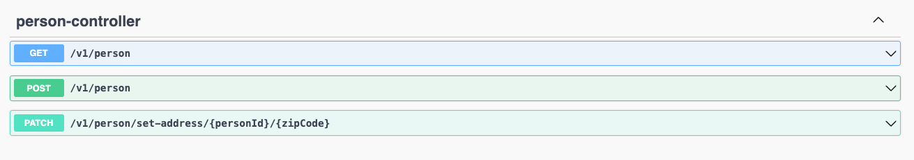

### Objetivo
Este projeto visa exemplificar a aplicação de princípios de Resiliência no desenvolvimento de Software.

### Casos de Uso:
- **Caso de Uso 1**: Registrar uma pessoa com Nome e Email
- **Caso de Uso 2**: Listar todas as pessoas registradas
- **Caso de Uso 3**: Adicionar um endereço a uma pessoa através de um CEP informado.

### Tecnologias Utilizadas:
- Java 21
- Spring Boot 3.x.x
- Spring Boot Starter Data Mongodb
- Spring Cloud 2023.x.x
- Spring Cloud Starter Open Feign
- Spring Boot Starter Aop
- SpringDoc Openapi Starter WebMvc
- Resilience4j Spring Boot2
- Lombok

### Endpoints
